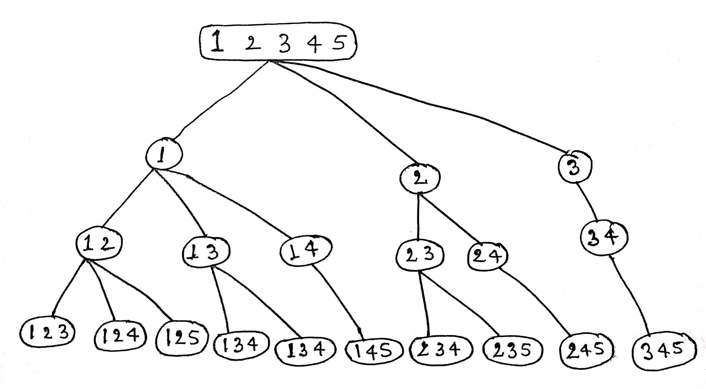

# Thought process
For this, we fix every element and combine it with every other element. We generate a combination tree where we fix each number from 1 to n and recursively build combinations of K numbers.

# Example
Suppose we have n=5, k=3
* First we fix the number 1 and recursively generate all unique combinations of size 3 starting with the number 1 such as: {1,2,3}, {1,2,4}, {1,2,5}, {1,3,4} and {1,4,5}
* Now we fix the number 2 and do similar as above starting with the number 2 such as: {2,3,4}, {2,3,5} and {2,4,5}
* Then we fix the number 3 and do similar as above starting with the number 3 such as: {3,4,5}
* There would be no unique combinations of size 3 starting from 4 and 5

